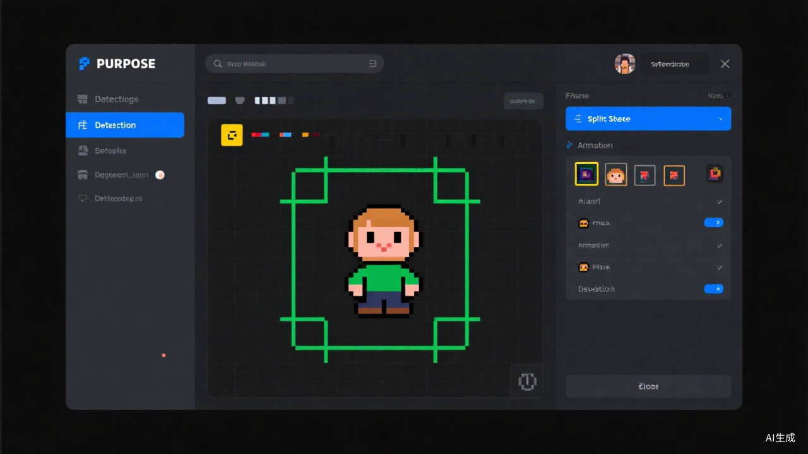
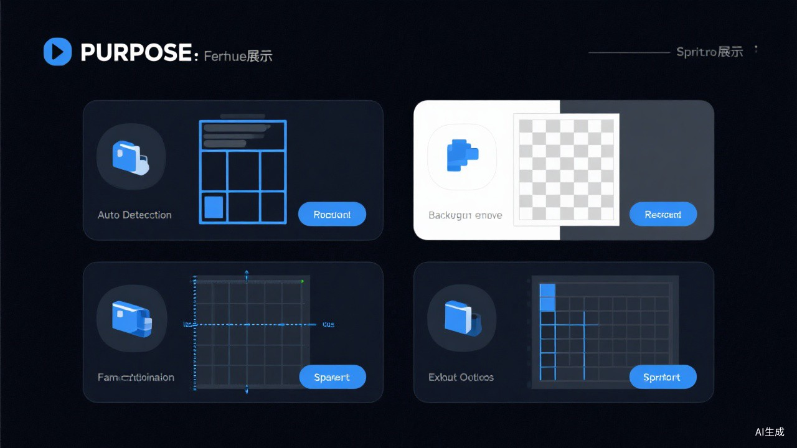

# SpriteForge

<p align="center">
  <strong>一款轻量级在线精灵表编辑器</strong><br>
  无需安装，打开即用 · 支持多图片 · 智能帧检测 · 一键导出
</p>

<p align="center">
  
</p>

---

## ✨ 功能特性

<p align="center">
  
</p>

### 🎯 帧检测与管理
- **自动检测** — 智能识别精灵表中的独立帧
- **手动框选** — 鼠标拖拽精确绘制帧区域
- **多选操作** — 全选、反选、批量删除
- **帧列表** — 可视化帧缩略图，点击选中

### 📐 帧尺寸约束
- **锁定顶部** — 对齐角色头顶（下蹲动画专用）
- **锁定底部** — 对齐地面线（跳跃动画专用）
- **锁定高度** — 统一帧高度
- **固定尺寸** — 自定义宽高
- **自由组合** — 上述约束可同时开启，灵活适配各种动画

### 🧹 背景消除
- **边缘泛洪（自动）** — 从图片边缘自动识别并消除背景
- **取色消除（手动）** — 点击背景色，可调容差精确控制
- **预览/应用/重置** — 非破坏性编辑，随时回退

### 🖼️ 多图片管理
- 同时打开多张图片，标签栏快速切换
- 每张图片独立保存帧数据、缩放和锁定状态
- 关闭图片自动保存，重新打开不丢失

### ⚡ 帧优化
- 自动对齐锚点（头、脚、中心等）
- 统一帧尺寸
- 动画预览，实时调整帧率
- 一键导出优化后的精灵表

### 📦 导出
- **导出精灵表** — 水平/垂直/网格排列
- **导出 ZIP** — 包含帧图 + 精灵表 + 元数据（JSON/CSV）
- 自定义内边距和文件名

---

## 🚀 快速开始

### 在线使用
直接打开 `index.html` 即可使用，无需安装任何依赖。

### 本地运行
```bash
# 克隆仓库
git clone https://github.com/shiyuchen1010-max/SpriteForge.git

# 用浏览器打开
open index.html
# 或使用本地服务器
python3 -m http.server 8080
```

---

## 🎮 使用流程

```
1. 加载图片 → 2. 自动/手动检测帧 → 3. 调整帧区域
     ↓
4. （可选）背景消除 → 5. （可选）帧优化对齐 → 6. 导出精灵表
```

### 快捷键
| 操作 | 快捷键 |
|------|--------|
| 框选帧 | 鼠标拖拽 |
| 选中帧 | 单击帧 |
| 多选帧 | Ctrl + 点击 |
| 全选 | Ctrl + A |
| 删除帧 | Delete |
| 缩放 | 滚轮 / +/- |
| 适应窗口 | Ctrl + 0 |
| 微调帧位置 | 方向键 |

---

## 🛠️ 技术栈

- **纯前端** — 单 HTML 文件，零依赖
- **原生 JS** — 无框架，加载快
- **Canvas API** — 高性能图片处理
- **暗色主题** — 护眼，适合长时间使用

---

## 📄 许可证

[MIT License](LICENSE)

---

<p align="center">
  Made with ❤️ for game developers
</p>
